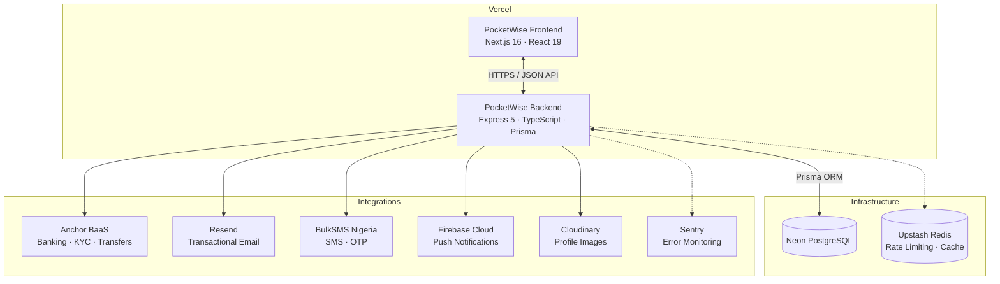

# PocketWise 💜

> **Smart Wallet for Nigerian Youth** — _Your money, automatically sorted._

PocketWise is a fintech monorepo that automatically splits every deposit into four purpose-driven wallets the moment money arrives — no manual budgeting, no willpower required. Default split is **50/30/10/10** (Spend/Savings/Emergency/Flex), fully configurable per user.

Built with real money via **Anchor BaaS** from day one.

---

## Architecture



---

## Workspaces

| Package                   | Path                         | Description                    |
| ------------------------- | ---------------------------- | ------------------------------ |
| `pocketwise-frontend`     | `apps/web`                   | Next.js 16 App Router frontend |
| `pocketwise-backend`      | `apps/api`                   | Express 5 REST API             |
| `mobile`                  | `apps/mobile`                | React Native app (coming soon) |
| `@repo/ui`                | `packages/ui`                | Shared UI components           |
| `@repo/tailwind-config`   | `packages/tailwind-config`   | Shared Tailwind v4 config      |
| `@repo/typescript-config` | `packages/typescript-config` | Shared TypeScript config       |
| `@repo/eslint-config`     | `packages/eslint-config`     | Shared ESLint config           |

---

## Prerequisites

- **Node.js** 20+ LTS
- **npm** 11+
- **PostgreSQL** 15+ (or Neon account for serverless)

---

## Getting Started

```bash
git clone https://github.com/charles806/pocketwise.git
cd pocketwise
npm install
```

Copy environment files:

```bash
cp apps/api/.env.example apps/api/.env      # backend
cp apps/web/.env.example apps/web/.env.local # frontend
```

Run both frontend and API in development:

```bash
npm run dev
```

- Frontend → http://localhost:3000
- API → http://localhost:1000

---

## Quick Links

| Doc                                | Location                                     |
| ---------------------------------- | -------------------------------------------- |
| Web app (routes, components, etc.) | [`apps/web/README.md`](./apps/web/README.md) |
| API (endpoints, auth, DB schema)   | [`apps/api/README.md`](./apps/api/README.md) |

---

## Environment Variables

### Backend (`apps/api/.env`)

| Variable                | Description                     |
| ----------------------- | ------------------------------- |
| `DATABASE_URL`          | PostgreSQL connection string    |
| `JWT_ACCESS_SECRET`     | Access token signing secret     |
| `JWT_REFRESH_SECRET`    | Refresh token signing secret    |
| `ANCHOR_API_KEY`        | Anchor BaaS API key             |
| `ANCHOR_WEBHOOK_SECRET` | Anchor webhook signature secret |
| `RESEND_API_KEY`        | Transactional email API key     |
| `BULKSMS_API_KEY`       | SMS API key                     |
| `BULKSMS_SENDER_ID`     | SMS sender ID                   |
| `CLOUDINARY_URL`        | Image upload cloud              |
| `SENTRY_DSN`            | Error monitoring                |
| `FRONTEND_URL`          | CORS origin for frontend        |
| `MOBILE_URL`            | CORS origin for mobile app      |
| `FIREBASE_*`            | Firebase Admin SDK credentials  |
| `UPSTASH_REDIS_URL`     | Rate limiting / cache           |
| `KEEP_ALIVE_SECRET`     | Internal cron endpoint auth     |

### Frontend (`apps/web/.env.local`)

| Variable                  | Description                |
| ------------------------- | -------------------------- |
| `NEXT_PUBLIC_BACKEND_URL` | API base URL               |
| `NEXT_PUBLIC_SENTRY_DSN`  | Frontend error monitoring  |
| `NEXT_PUBLIC_FIREBASE_*`  | Firebase client SDK config |

---

## Deployment

| Service | What                     |
| ------- | ------------------------ |
| Vercel  | Frontend (Next.js)       |
| Vercel  | API (Express serverless) |
| Neon    | PostgreSQL (serverless)  |
| GitHub  | Version control          |

---

_PocketWise — Building the financial backbone of Nigerian youth._
